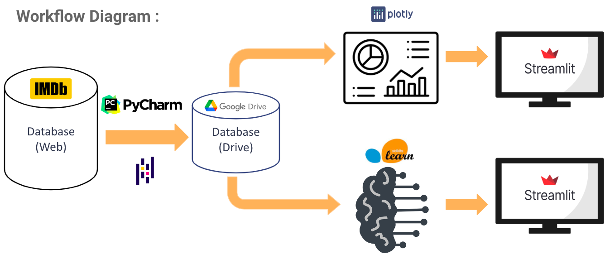
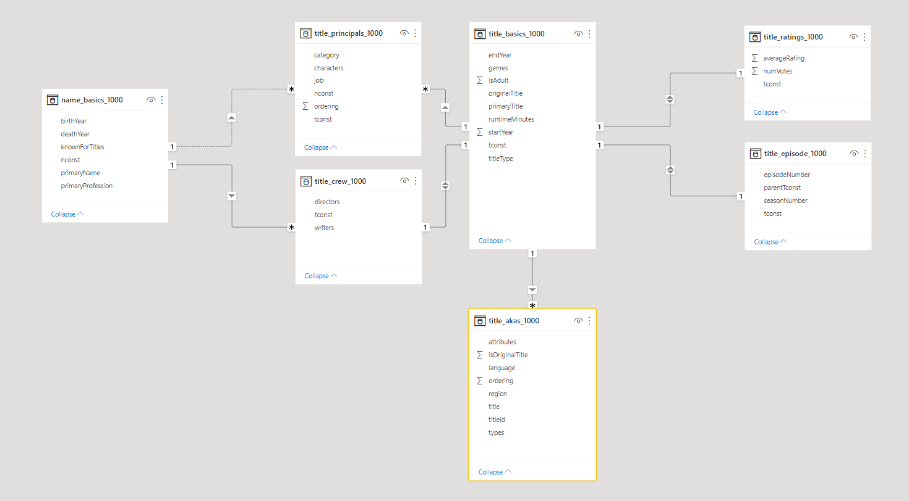
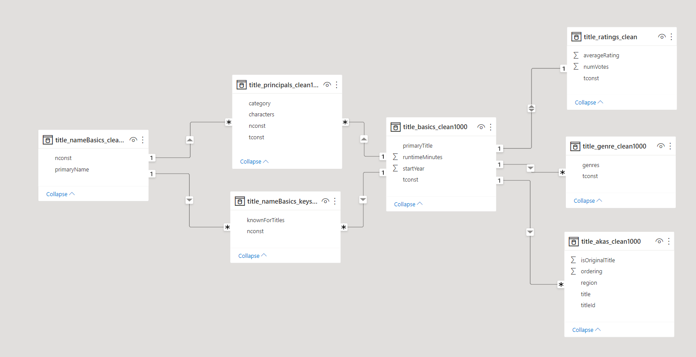

# :clapper: Movie Recommendations System

Student Project using :
 - Python for processing data
 - Streamlit for building the web page of our system

## :ledger: Index

 - [Subject](#beginner-subject)
 - [Product Backlogs](#dart-product-backlogs)
 - [Workflow diagram](h#wrench-tools)
 - [Steps of the project](#scroll-steps-of-the-project)
 - [Gallery](#camera-gallery)
 - [Tools](#wrench-tools)
 - [Team members](#handshake-team-members)

## :beginner: Subject

We were commissioned as data analysts freelances by a fictitious cinema's director.
Its company is losing ground, that's why he has decided to go digital by creating a website.
To go even further, he asks us to create a film recommendations system.
This one must use the films database based on the IMDb platform.

## :dart: Product Backlogs

The goal of the project revolves around these 2 topics :
 - **Analysis** : making a complete analysis of the database
 - **Recommendation system** : create an algorithm to recommend films that have been appreciated by the user

## :twisted_rightwards_arrows: Workflow diagram

## :scroll: Steps of the project

 - Retrieving tables (csv format) from the IMDb database (here) and the documentation associated (here)
 - Checking the integrity of the data
 - Reduce the database to the strictly necessary information
 - Define topics and define indicators around these topics
 - Creation of the recommendation system using machine learning
 - Displaying the results (analysis and recommendation system) on a web page using Streamlit

NB : Our csv files were too large and we could not put them on Git. So you won't be able to run these scripts.
However, you can have a look at our video files in the gallery section.

## :camera: Gallery

#### Modelisation of the raw database

#### Modelisation of the raw database

#### Video of the analysis

#### Video of the recommendation system

## :wrench: Tools

## :handshake: Team members

 - [Aurélien GAZENGEL](https://github.com/Aurelien-GZL)
 - [Mohammed BOUSSALEM](https://github.com/boussalemmo)
 - [Marion FOURRIER](https://github.com/MarionFourrier)
 - [Alexandre CANIZAREZ](https://github.com/AlexCNZRZ)

## :lock: License

This project is licensed under the terms of the MIT.
